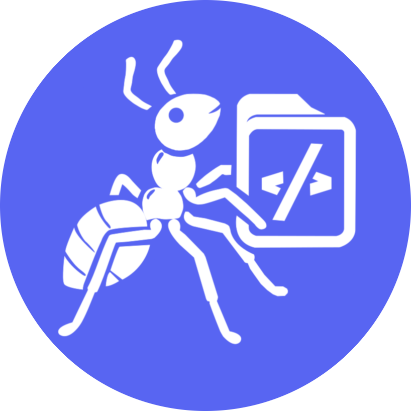

<h1 style="display:flex; align-items:center; gap:8px; justify-content:center">
  
  HormigaDev
</h1>

**Full Stack Developer**

🌐 **[hormiga.dev](https://www.hormiga.dev)**

---

## 👨‍💻 About

Full Stack Developer focused on **systems programming** and **developer tools**. I build robust, performant applications and tools that make developers' lives easier.

## 🛠️ Tech Stack

**Core:** Rust • TypeScript • JavaScript  
**Frontend:** Vue 3 • Astro  
**Backend:** Node.js • PostgreSQL • Redis  
**DevOps:** Linux • Nginx • Docker • Git

## 🚀 Featured Projects

### 🦀 [Miga CLI](https://github.com/HormigaDev/miga-cli)

Ultra-fast command-line interface built in Rust for project scaffolding and automation. Designed for developers who value speed and efficiency, Miga CLI delivers high performance for rapid project setup and workflow automation.

### 📘 [Patto Ecosystem](https://github.com/HormigaDev/patto-bot-template)

TypeScript-based validation and contracts ecosystem with an extensible plugin architecture. Patto provides type-safe validation patterns and reusable contracts for building robust applications with confidence.

### 🍷 [Vin Rouge Bistrô](https://github.com/HormigaDev/vin-rouge-bistro)

Modern digital platform for a French bistro featuring a real-time reservation system and interactive menu. Built with Vue 3, this application showcases elegant UI design combined with powerful backend functionality.

## 🤝 Connect

---

**Made with ❤️ and ☕**

